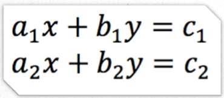

1. https://kodaktor.ru/js01_intro_lr.pdf
2. Задание-разминка о решении системы линейных уравнений методом Крамера.


Напишите линейный алгоритм на JS, начинающийся со строки

```JavaScript
const [a1, b1, c1, a2, b2, c2] = [1, 3, 2, 9, 2, 7];
```
вычисляющий корни системы и выводящий их в консоль

3. Задание по разворачиванию связки PHP+FPM+NGINX (см. файл php1.pdf в этой ветке)


4. Развернув, выполнить задание 2 в том числе и на PHP
 * вам нужно сразу спроектировать доступ к вашим решениям с возможностью тестирования
 
5. https://github.com/GossJS/vagrant - для пользователей Windows

6. На дальнейшее - сообщение на тему анализа Dart и Go (и других на ваш выбор) языков по той схеме, которая была приведена в лекции

---

cloud9

https://c9.io/kodent?type=shared

логин - kodent, пароль - стандартный.

Вам будут доступны проекты js-study1 и php-study1, расшаренные из аккаунта gossoudarev

там есть папка mag - в ней вы можете создавать свои папки
